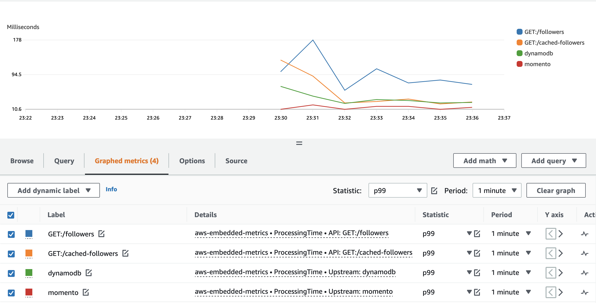

# Serverless Typescript API With Momento

This tutorial shows a basic serverless typescript REST api using DynamoDB supercharged with [Momento](https://www.gomomento.com/). It contains a 
Serverless Application that can be built and deployed with [SAM](https://docs.aws.amazon.com/serverless-application-model/latest/developerguide/what-is-sam.html) cli. The API is supposed to represent a basic `users` 
api. It contains the following endpoints:

```text
# Generates base users in DDB to use for test 
POST /bootstrap-users

# Get single user
GET /users?id=1
GET /cached-users?id=1

# Get passed users followers names
GET /followers?id=1
GET /cached-followers?id=1
```

#### POST /bootstrap-users
Bootstraps all the test user data needed. For this demo it generates
100 test users each following 50-60 random other test users.

#### GET /users & /cached-users
Makes either 1 call to DynamoDB or Momento
```text
$ curl https://x949ucadkh.execute-api.us-east-1.amazonaws.com/Prod/cached-users\?id\=2 -s | jq .
{
  "id": "2",
  "followers": [ "36", "4", "21", "21", "69", "69", "60", "48", "20", "35", "57", "51", "37", "75", "61", "48", "69", "28", "60", "30", "41", "79", "75", "46", "21", "51", "37", "52", "76", "62", "11", "38", "98", "10", "15", "90", "5", "97", "70", "44", "88", "31", "76", "97", "48", "15", "85", "64", "93", "5"],
  "name": "happy wombat"
}
```

##### GET /followers & /cached-followers
Will make 1 call to either DDB or Momento for passed user id and then N 
additional calls to either DDB or Momento to look up each follower name.
```text
$ curl https://x949ucadkh.execute-api.us-east-1.amazonaws.com/Prod/cached-followers\?id\=1 -s
["Dumb Rabbit","Excited Wombat","Lazy Squirrel","Lazy Sloth","Strange Rabbit","Lazy Squirrel","Mystical Dog","Strange Cat","Dumb Dog","Excited Dog","Clingy Lion","Strange Frog","Strange Rabbit","Lazy Frog","Happy Sloth","Happy Sloth","Sad Cat","Clingy Cat","Happy Sloth","Obnoxious Fish","Excited Lion","Spacey Frog","Goofy Dog","Goofy Dog","Happy Hamster","Obnoxious Dog","Sad Cat","Obnoxious Lion","Happy Sloth","Obnoxious Otter","Angry Dog","Sad Rabbit","Excited Fish","Dumb Hamster","Clingy Otter","Angry Dog","Happy Hamster","Happy Hamster","Clingy Hamster","Happy Sloth","Happy Dog","Spacey Wombat","Clingy Lion","Clingy Sloth","Clingy Hamster","Rare Lion","Spacey Wombat","Angry Rabbit","Mystical Zebra","Excited Frog","Happy Dog","Angry Dog","Spacey Wombat"]%
```
When deployed you will have an application that looks like this deployed into your account.


The lambda application will produce the following cloud watch metrics for you to compare in cloudwatch 
```text
ddb-get
momento-get

get-followers
get-cached-followers
```

## Pre-reqs
* [Docker](https://docs.docker.com/engine/install/)
* [AWS CLI](https://docs.aws.amazon.com/cli/latest/userguide/getting-started-install.html)
* [Local AWS Credentials](https://docs.aws.amazon.com/cli/latest/userguide/cli-configure-quickstart.html)
* [SAM CLI](https://docs.aws.amazon.com/serverless-application-model/latest/developerguide/serverless-sam-cli-install.html)
  * _Note: Make sure you are on latest version_

## Tutorial
1. Please clone this repo.
    1. `git clone git@github.com:momentohq/serverless-api-demo.git`
2. Change working directory to the repo you just cloned
    1. `cd serverless-api-demo`
3. Make sure you have your local AWS credentials configured. Please see [here](https://docs.aws.amazon.com/cli/latest/userguide/cli-configure-quickstart.html) for more info on getting started.
4. Install Momento CLI
   1. `brew tap momentohq/tap` 
   2. `brew install momento-cli`
5. Obtain a momento auth token in us-east-1
   1. `momento account signup aws --region us-east-1 --email my-email@demo.com`
6. Update your Momento Auth token for `us-east-1` in [app.ts](https://github.com/momentohq/serverless-api-demo/blob/main/src/app.ts#L10) update `REPLACE_ME`.
7. Create a cache for demo with momento cli
   1. `momento configure --quick`
   2. `momento cache create --name momento-demo-users`
8. Build the project
    1. `sam build --beta-features`
9. Deploy the project into your AWS account
    1. `sam deploy --resolve-s3`
10. Get the URL of your new API from cfn output shown after `sam deploy` and set in env variable.
    1. ex: `export API_URL=https://x949ucadkh.execute-api.us-east-1.amazonaws.com/Prod`
       1. _Make sure to replace with your demo stack value `x949ucadkh` is just an example._
11. Bootstrap test users
    1. `curl -X POST "$API_URL/bootstrap-users"`
12. Start benchmark script
     1. `cd bench && ./start.sh`
13. Navigate to locust dashboard at http://0.0.0.0:8089/
    1. Start synthetic test with `20` users and spawn rate of `5`
    2. Make sure to enter host you got from output of `sam deploy`
14. Open AWS Cloudwatch Metrics service in your aws account and Look for [aws-embeded-metrics](https://us-east-1.console.aws.amazon.com/cloudwatch/home?region=us-east-1#metricsV2:graph=~();namespace=~'aws-embedded-metrics) under the 'custom' metric namespace
    1. _Be patient if metrics dont show up right away can take a minute at first._
15. Chart custom metrics to compare response times. 
    

