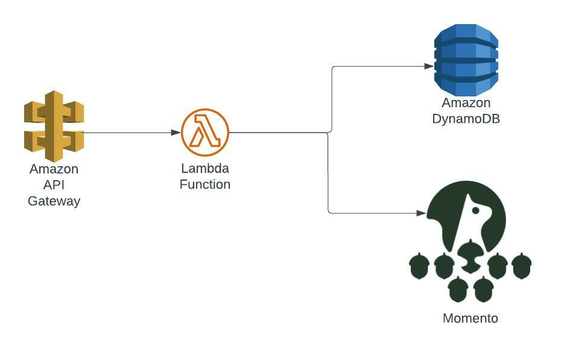
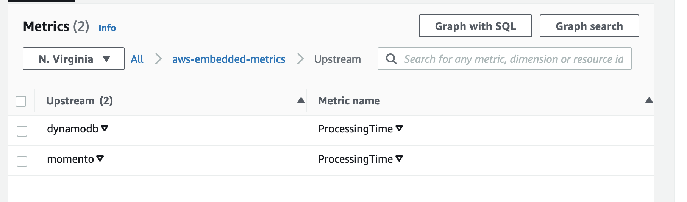
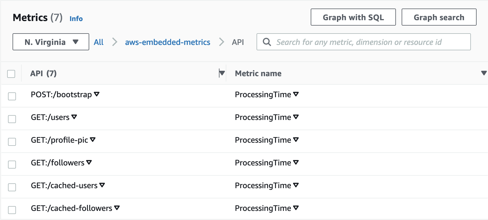
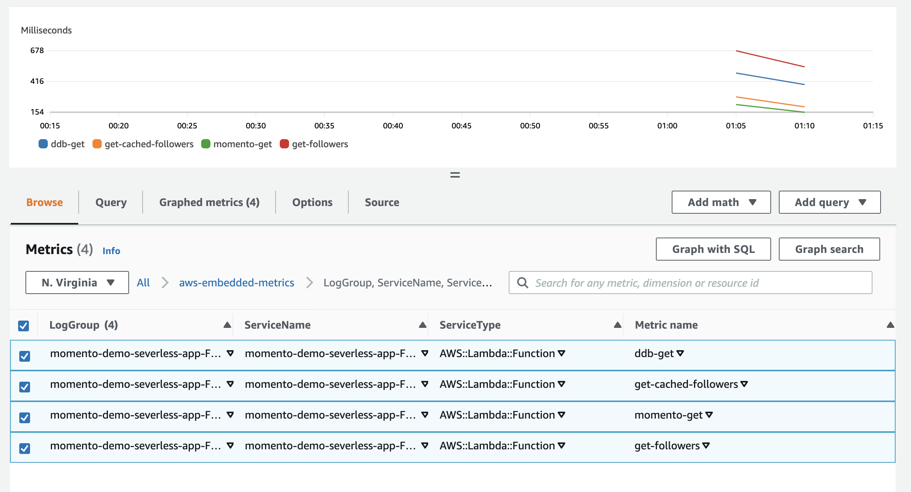

Follow this guide for deploying and benchmarking the demo API in your AWS Account

## Pre-reqs
* [NodeJs](https://nodejs.org/)
* [Local AWS Credentials](https://docs.aws.amazon.com/cli/latest/userguide/cli-configure-quickstart.html)
* [Docker](https://www.docker.com/)

When deployed you will have an application that looks like this in your account:

The lambda application will produce several CloudWatch metrics for you to explore and contrast once you start
driving load.

We have a granular Upstream ProcessingTime metric for Momento and DynamoDB response times

As well as top level API response time metrics for all our exposed APIs

## Tutorial
1. Please clone this repo.
    1. `git clone git@github.com:momentohq/serverless-api-demo.git`
2. Change working directory to the repo you just cloned and install dependencies
    1. `cd serverless-api-demo/src`
    2. `npm install`
    3. `cd ..`
3. Make sure you have your local AWS credentials configured. Please see [here](https://docs.aws.amazon.com/cli/latest/userguide/cli-configure-quickstart.html) for more info on getting started.
4. If you have not done previously bootstrap your aws account for CDK in `us-east-1`
    1. `cd infra/aws`
    2. `AWS_REGION=us-east-1 npm run cdk bootstrap`
5. Install Momento CLI
    1. `brew tap momentohq/tap`
    2. `brew install momento-cli`
6. Obtain a momento auth token in `us-east-1`
    1. `momento account signup aws --region us-east-1 --email my-email@demo.com`
7. Update your Momento Auth token for `us-east-1` in [src/repository/users.ts](https://github.com/momentohq/serverless-api-demo/blob/main/src/repository/users.ts#L7) update `REPLACE_ME`.
8. Create a cache for demo with momento cli
    1. `momento configure --quick`
    2. `momento cache create --name momento-demo-users`
9. Build the cdk infra project
    1. `npm run build`
10. Deploy the project into your AWS account
    1. `AWS_REGION=us-east-1 npm run cdk deploy`
11. Get the URL of your new API from cfn output shown after `npm run cdk deploy` and set in env variable.
    1. ex: `export API_URL=https://x949ucadkh.execute-api.us-east-1.amazonaws.com/Prod`
        1. _Make sure to replace with your demo stack value `x949ucadkh` is just an example._
12. Bootstrap test users
    1. `curl -X POST "$API_URL/bootstrap-users"`
13. Start benchmark script
    1. `cd bench && ./start.sh`
14. Navigate to locust dashboard at http://0.0.0.0:8089/
    1. Start synthetic test with `10` users and spawn rate of `2`
    2. Make sure to enter host you got from output of `npm run cdk deploy`
15. Open AWS Cloudwatch Metrics service in your aws account and Look for [aws-embedded-metrics](https://us-east-1.console.aws.amazon.com/cloudwatch/home?region=us-east-1#metricsV2:graph=~();namespace=~'aws-embedded-metrics) under the 'custom' metric namespace
    1. _Be patient if metrics don't show up right away. It can take a few minutes at first._
16. Chart custom metrics to compare response times.
    
16. Try adjusting graph to see metrics better
    1. Change the timespan from 3h to the last 10 minutes
    2. Set the period of metrics to 1-minute
17. Stop load driver by stopping shell you ran `start.sh` in or from browser UI
18. You can tear down infrastructure used for testing when you are done with following command
    1. `npm run cdk destroy`

