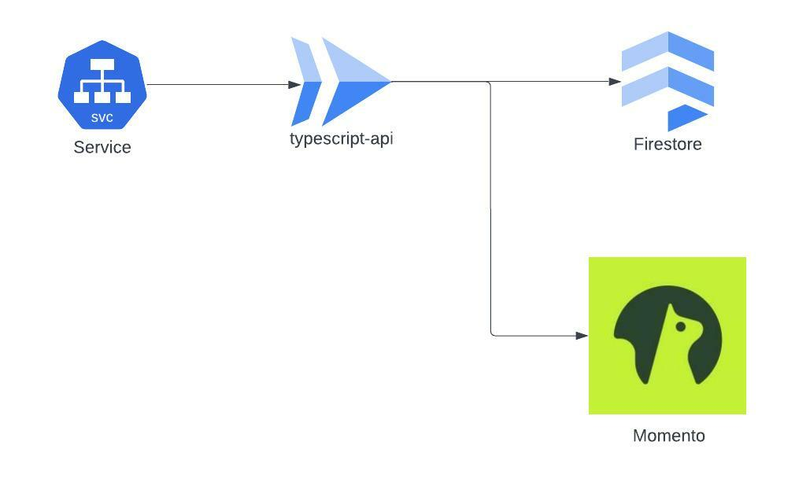
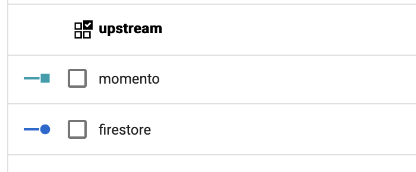
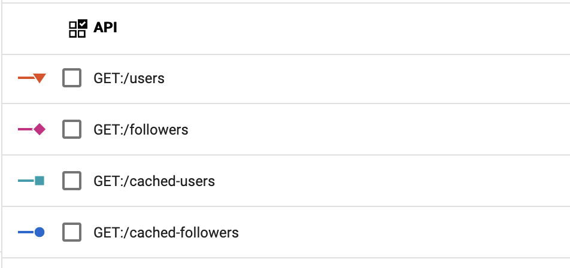
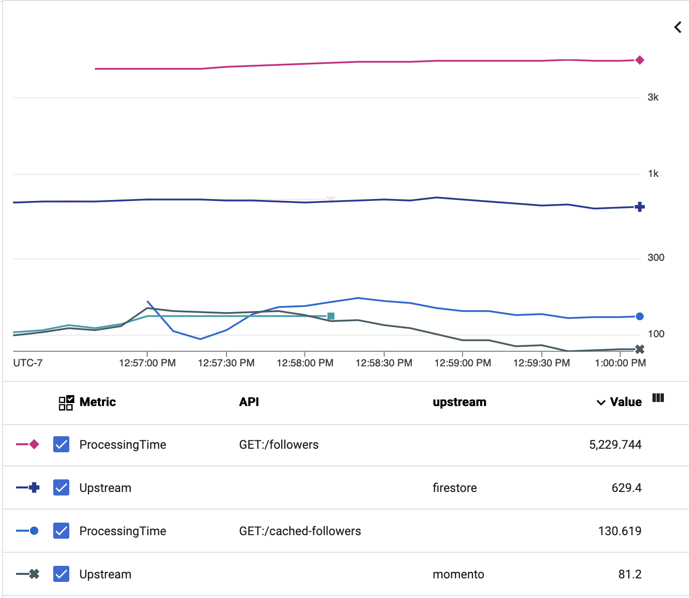

Follow this guide for deploying and benchmarking the demo API in your GCP Account

## Pre-reqs
* [NodeJs](https://nodejs.org/)
* [Local GCP CLI and Credentials](https://cloud.google.com/sdk/docs/install-sdk)
* [Docker](https://www.docker.com/)

When deployed you will have an application that looks like this in your account:

The lambda application will produce several metrics for you to explore and contrast once you start
driving load.

We have a granular Upstream ProcessingTime metric for Momento and Firestore response times

As well as top level API response time metrics for all our exposed APIs

## Tutorial
1. Please clone this repo.
    1. `git clone git@github.com:momentohq/serverless-api-demo.git`
2. Change working directory to the repo you just cloned and install dependencies
    1. `cd serverless-api-demo/src`
    2. `npm install`
    3. `cd ..`
3. Make sure you have your local GCP credentials configured. Please see [here](https://cloud.google.com/sdk/docs/install-sdk) for more info on getting started.
4. Please install pulumi cli and set up an account
   1. https://www.pulumi.com/docs/get-started/gcp/begin/
5. Install Momento CLI
    1. `brew tap momentohq/tap`
    2. `brew install momento-cli`
6. Obtain a momento auth token in gcp `us-east1`
    1. `momento account signup gcp --region us-east1 --email my-email@demo.com`
7. Update your Momento Auth token for `us-east1` in [src/repository/users.ts](https://github.com/momentohq/serverless-api-demo/blob/main/src/repository/users.ts#L4) update `REPLACE_ME`.
8. Create a cache for demo with momento cli
    1. `momento configure --quick`
    2. `momento cache create --name momento-demo-users`
9. Build the  project
    1. `cd src && npm run compile-service && cd ..`
10. Init pulumi stack
    1. `cd infra/gcp`
    2. `pulumi config set gcp:project my-google-project-id`
    3. `pulumi config set gcp:region us-east1`
    4. `pulumi stack init dev`
11. Deploy the project into your GCP account
    1. `pulumi up`
12. Get the URL of your new API from output shown after running `pulumi up` and set in env variable.
    1. ex: `export API_URL=https://ts-api-svc-59b4428-pao3gfd3nq-ue.a.run.app`
        1. _Make sure to replace with your demo stack value the one above is just an example._
13. Bootstrap test users
    1. `curl -X POST "$API_URL/bootstrap-users"`
14. Start benchmark script
    1. `cd bench && ./start.sh`
15. Navigate to locust dashboard at http://0.0.0.0:8089/
    1. Start synthetic test with `20` users and spawn rate of `2`
    2. Make sure to enter host you got from output of `pulumi up`
16. Open Google Metrics service in your gcp account and Look for [MetricExplorer](https://console.cloud.google.com/monitoring/metrics-explorer) Look under `Global>Custom` 'custom' metric namespace
    1. _Be patient if metrics don't show up right away. It can take a few minutes at first._
17. Chart custom metrics to compare response times.
    
    _Note: that this chart is using a Log Scale for response times to show better_
18. Stop load driver by stopping shell you ran `start.sh` in or from browser UI
19. You can tear down infrastructure used for testing when you are done with following command
    1. `pulumi destroys`
    1. `pulumi stack rm dev`

